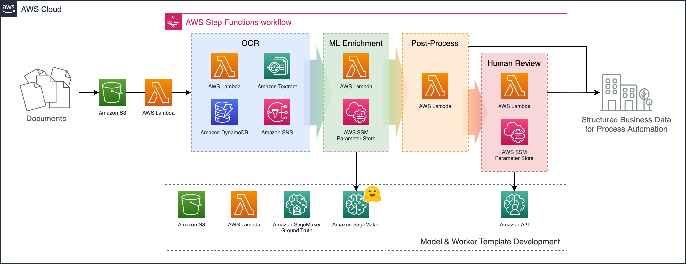
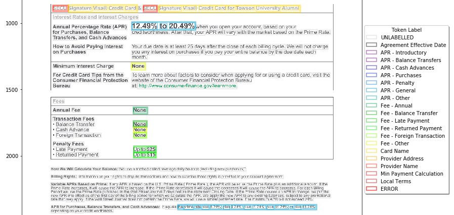
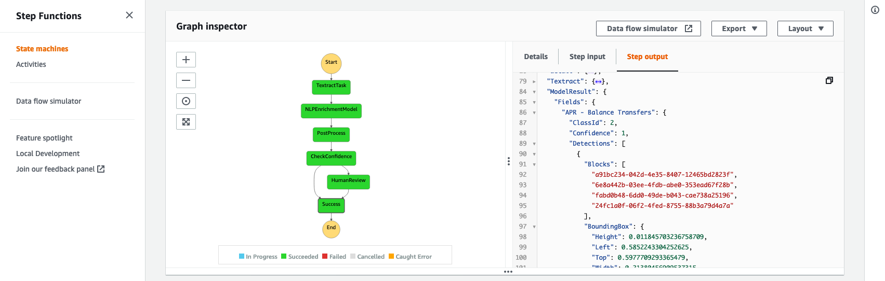

# Trainable Document Extraction with Transformer Models on Amazon SageMaker

To automate document-based business processes, we usually need to extract specific, standard data points from diverse input documents: For example, vendor and line-item details from purchase orders; customer name and date-of-birth from identity documents; or specific clauses in contracts.

In human-readable documents, **both layout and text content are important** to extract meaning: So accuracy may be disappointing when using text-only methods (like regular expressions or entity recognition models), position-only methods (like template-based models), or manual combinations of the two.

This sample and accompanying [blog post](https://aws.amazon.com/blogs/machine-learning/bring-structure-to-diverse-documents-with-amazon-textract-and-transformer-based-models-on-amazon-sagemaker/) demonstrate **trainable, multi-modal, layout-aware document understanding** on AWS using [Amazon SageMaker](https://aws.amazon.com/sagemaker/) and open-source models from [Hugging Face Transformers](https://huggingface.co/docs/transformers/index) - optionally integrated with [Amazon Textract](https://docs.aws.amazon.com/textract/latest/dg/what-is.html).


## Solution Overview

This sample sets up a **document processing pipeline** orchestrated by [AWS Step Functions](https://aws.amazon.com/step-functions/), as shown below:



Documents uploaded to the input bucket automatically trigger the workflow, which:

1. Extracts document data using Amazon Textract (or an alternative OCR engine).
2. Enriches the Textract/OCR JSON with extra insights using an ML model deployed in SageMaker.
3. Consolidates the business-level fields in a post-processing Lambda function.
4. (If any expected fields were missing or low-confidence), forwards the results to a human reviewer.

In the provided example, input documents are specimen **credit card agreements** per **[this dataset](https://www.consumerfinance.gov/credit-cards/agreements/)** published by the [US Consumer Finance Protection Bureau (CFPB)](https://www.consumerfinance.gov/).

We define a diverse set of "fields" of interest: from short entity-like fields (such as provider name, credit card name, and effective date), to longer and more flexible concepts (like "minimum payment calculation method" and "terms applicable to local areas only").

Bounding box ananotations are collected to train a SageMaker ML model to classify the words detected by Amazon Textract between these field types - using **both** the content of the text and the location/size of each word as inputs:



From this enriched JSON, the post-processing Lambda can apply simple rule-based logic to extract and validate the fields of interest.

For any documents where required fields could not be detected confidently, the output is forwarded to human review using [Amazon Augmented AI (A2I)](https://aws.amazon.com/augmented-ai/) with a customized **task template** UI:


By orchestrating the process through AWS Step Functions (rather than point-to-point integrations between each stage for example), we gain the benefits that the overall flow can be graphically visualized and individual stages can be more easily customized. A wide range of integration options are available for adding new stages and storing results (or triggering further workflows) from the output:




## Getting Started

To deploy this sample you'll need access to your target AWS Account with sufficient *permissions* to deploy the various resources created by the solution (which includes IAM resources).

**Skipping local setup**

Steps 0-3 below are for locally building and deploying the CDK solution and require setting up some developer-oriented tools. If you can't do this or prefer not to, you can **deploy the following "bootstrap" CloudFormation stack and skip to step 4**:

[](https://console.aws.amazon.com/cloudformation/home?#/stacks/create/review?templateURL=https://s3.amazonaws.com/amazon-textract-transformer-pipeline-assets/attp-bootstrap.cfn.yaml&stackName=ATTPBootstrap "Launch Stack") (Or use [.infrastructure/attp-bootstrap.cfn.yaml](.infrastructure/attp-bootstrap.cfn.yaml))

> ⚠️ **Note** before using this option:
> - This bootstrap stack grants broad IAM permissions to the created AWS CodeBuild project role for deploying the sample - so it's **not recommended for use in production environments.**
> - If using the 'Launch Stack' button above, remember to check it opens the Console in the correct AWS Region you want to deploy in and switch regions if necessary.
> - Creating (or updating) the bootstrap stack will *start* the process of fetching and deploying the latest sample code, but *not wait for it to finish*. Check the AWS CodeBuild console (link in the bootstrap stack 'Outputs' tab) for build project status and you should see additional separate [CloudFormation stacks](https://console.aws.amazon.com/cloudformation/home?#/stacks) created within a few minutes.
> - Likewise deleting the bootstrap stack will not delete the sample deployment: You can clean up by deleting the other CloudFormation stacks.

The bootstrap stack pretty much runs the following steps 0-3 for you in an AWS CodeBuild environment, instead of locally on your computer:

**Step 0: Local build prerequisites**

To build and deploy this solution, you'll first need:

- The [AWS CDK (v2)](https://docs.aws.amazon.com/cdk/latest/guide/getting_started.html#getting_started_install), which depends on [NodeJS](https://nodejs.org/en/).
- [Python v3.8+](https://www.python.org/)
- [Docker](https://www.docker.com/products/docker-desktop) installed and running (which is used for [bundling Python Lambda functions](https://docs.aws.amazon.com/cdk/api/v2/docs/aws-lambda-python-alpha-readme.html)).
  - You can see the [discussion here](https://github.com/aws/aws-cdk/issues/16209) on using [podman](https://podman.io/) as an alternative with CDK if Docker Desktop licensing is not available for you.
- (Optional but recommended) consider using [Poetry](https://python-poetry.org/docs/#installation) rather than Python's built-in `pip`.

CDK Lambda Function bundling uses container images hosted on [Amazon ECR Public](https://docs.aws.amazon.com/AmazonECR/latest/public/what-is-ecr.html), so you'll likely need to [authenticate](https://docs.aws.amazon.com/AmazonECR/latest/public/public-registries.html#public-registry-auth) to pull these. For example:

```sh
# (Always us-east-1 here, regardless of your target region)
aws ecr-public get-login-password --region us-east-1 | docker login --username AWS --password-stdin public.ecr.aws
```

You'll also need to [bootstrap your AWS environment for CDK](https://docs.aws.amazon.com/cdk/latest/guide/bootstrapping.html#bootstrapping-howto) **with the modern template** if you haven't already. For example:

```sh
# Assuming your AWS CLI Account and AWS_REGION / AWS_DEFAULT_REGION are set:
export CDK_NEW_BOOTSTRAP=1
cdk bootstrap
```

> 🚀 **To try the solution out with your own documents and entity types:** Review the standard steps below first, but find further guidance in [CUSTOMIZATION_GUIDE.md](CUSTOMIZATION_GUIDE.md).

**Step 1: Set up and activate the project's virtual environment**

If you're using Poetry, you should be able to simply run (from this folder):

```sh
poetry shell
```

Otherwise, you can instead run:

```sh
# (Create the virtual environment)
python3 -m venv .venv
# (Activate the virtual environment)
source .venv/bin/activate
```

Depending on your setup, your Python v3 installation may simply be called `python` instead of `python3`. If you're on Windows, you can instead try to activate by running `.venv\Scripts\activate.bat`.

**Step 2: Install project dependencies**

Once the virtual environment is active, install the required dependencies by running:

```sh
# For Poetry:
poetry install
# ...OR, without Poetry:
pip install -e .[dev]
```

**Step 3: Deploy the solution stacks with CDK**

To deploy (or update, if already deployed) all stacks in the solution to your default AWS Region, with default configuration, run:

```sh
cdk deploy --all
# To skip approval prompts, you can optionally add: --require-approval never
```

Some aspects of the solution can also be configured by setting environment variables before running `cdk deploy`. See [cdk_app.py](cdk_app.py) and the [Customization Guide](CUSTOMIZATION_GUIDE.md) for details, but the defaults are a good starting point.

> Note that some AWS Regions may not support all services required to run the solution, but it has been tested successfully in at least `ap-southeast-1` (Singapore), `us-east-1` (N. Virginia), and `us-east-2` (Ohio).

You'll be able to see the deployed stacks in the [AWS CloudFormation Console](https://console.aws.amazon.com/cloudformation/home?#/stacks).

**Step 4: Set up your notebook environment in Amazon SageMaker**

The solution stack does not automatically spin up a SageMaker notebook environment because A) there are multiple options and B) users may have an existing one already.

If you're able, we recommend following the instructions to [onboard to SageMaker Studio](https://docs.aws.amazon.com/sagemaker/latest/dg/gs-studio-onboard.html) for a more fully-featured user experience and easier setup.

If this is not possible, you can instead choose to [create a classic SageMaker Notebook Instance](https://docs.aws.amazon.com/sagemaker/latest/dg/gs-console.html). If using a classic notebook instance:

- Instance type `ml.t3.medium` and volume size `30GB` should be sufficient to run through the sample
- This repository uses interactive notebook widgets, so you'll need to install extension `@jupyter-widgets/jupyterlab-manager` either through the extensions manager UI (*Settings > Enable Extension Manager*) or by attaching a [lifecycle configuration script](https://docs.aws.amazon.com/sagemaker/latest/dg/notebook-lifecycle-config.html) customizing the [install-lab-extension template](https://github.com/aws-samples/amazon-sagemaker-notebook-instance-lifecycle-config-samples/tree/master/scripts/install-lab-extension) to to reference this particular extension.

Whichever environment type you use, the **execution role** attached to your Notebook Instance or Studio User Profile will need some additional permissions beyond basic SageMaker access:
  - Find your deployed OCR pipeline stack in the [AWS CloudFormation Console](https://console.aws.amazon.com/cloudformation/home?#/stacks) and look up the `DataSciencePolicyName` from the **Outputs** tab.
  - Next, find your studio user's or notebook instance's *SageMaker execution role* in the [AWS IAM Roles Console](https://console.aws.amazon.com/iamv2/home#/roles)
  - Click the **Attach policies** button to attach the stack's created data science policy to your SageMaker role.

> ⚠️ **Warning:** The managed `AmazonSageMakerFullAccess` policy that some SageMaker on-boarding guides suggest to use grants a broad set of permissions. This can be useful for initial experimentation, but you should consider scoping down access further for shared or production environments.
>
> *In addition* to the `DataSciencePolicy` created by the stack, this sample assumes that your SageMaker execution role has permissions to:
>
> - Access the internet (to install some additional packages)
> - Read and write the SageMaker default S3 bucket
> - Train, and deploy models (and optionally perform automatic hyperparameter tuning) on GPU-accelerated instance types - and invoke the deployed endpoint to test the model
> - Create SageMaker Ground Truth labeling jobs
> - Create task templates and workflow definitions in Amazon A2I
>
> To learn more about security with SageMaker, and get started implementing additional controls on your environment, you can refer to the [Security section of the SageMaker Developer Guide](https://docs.aws.amazon.com/sagemaker/latest/dg/security.html) - as well as this [AWS ML Blog Post](https://aws.amazon.com/blogs/machine-learning/building-secure-machine-learning-environments-with-amazon-sagemaker/) and associated [workshops](https://sagemaker-workshop.com/security_for_sysops.html).

Once your environment is set up, you can:

- Open JupyterLab (clicking 'Open Studio' for Studio, or 'Open JupyterLab' for a NBI)
- Open a system terminal window in JupyterLab
- (If you're on a new SageMaker Notebook Instance, move to the Jupyter root folder with `cd ~/SageMaker`)
- Clone in this repository with:

```sh
git clone https://github.com/aws-samples/amazon-textract-transformer-pipeline
```

**Step 5: Follow through the setup notebooks**

The Python notebooks in the [notebooks/ folder](notebooks) will guide you through the remaining activities to annotate data, train the post-processing model, and configure and test the solution stack. Open each of the `.ipynb` files in numbered order to follow along.


## Background and Use Case Validation

[Amazon Textract](https://docs.aws.amazon.com/textract/latest/dg/what-is.html) is a service that automatically extracts text, handwriting, and some structured data from scanned documents: Going beyond simple optical character recognition (OCR) to identify and extract data from tables (with rows and cells), and forms (as key-value pairs).

Many document understanding tasks can already be tackled with Amazon Textract and the [Amazon Comprehend](https://aws.amazon.com/comprehend/) AI service for natural language processing. For example:

- With the [Forms and Tables APIs](https://aws.amazon.com/textract/features/), Amazon Textract can extract key-value pairs and data tables from documents with no training required.
- With [Amazon Textract Queries](https://aws.amazon.com/about-aws/whats-new/2022/04/amazon-textract-launches-queries-feature-analyze-document-api/), users can ask simple natural-language questions to guide extraction of specific data points from a page.
- With [Amazon Comprehend native document NER](https://aws.amazon.com/blogs/machine-learning/extract-custom-entities-from-documents-in-their-native-format-with-amazon-comprehend/), users can train layout-aware models to extract entities from documents.
- Amazon Textract provides purpose-built APIs for some common document types like [invoices and receipts](https://docs.aws.amazon.com/textract/latest/dg/invoices-receipts.html) and [driving licenses and passports](https://docs.aws.amazon.com/textract/latest/dg/how-it-works-identity.html).

This sample demonstrates layout-aware entity recognition, similar to Amazon Comprehend trained with PDF document annotations. In general, users should consider fully-managed AI service options before selecting a more custom SageMaker-based solution like the one shown here. However, this sample may be interesting to users who want:

- To process documents in languages not currently [supported](https://docs.aws.amazon.com/comprehend/latest/dg/supported-languages.html#supported-languages-feature) by Comprehend PDF/document entity recognition - or Amazon Textract Queries.
- To customize the modelling tasks - for example for joint entity recognition + document classification, or question answering, or sequence-to-sequence generation.
- To integrate new model architectures from research and open source.
- To use the end-to-end pipeline already set up here for model training, deployment, and human review.


## Next Steps

For this demo we selected the credit card agreement corpus as a good example of a challenging dataset with lots of variability between documents, and realistic commercial document formatting and tone (as opposed to, for example, academic papers).

We also demonstrated detection of field/entity types with quite different characteristics: From short values like annual fee amounts or dates, to full sentences/paragraphs.

The approach should work well for many different document types, and the solution is designed with customization of the field list in mind.

However, there are many more opportunities to extend the approach. For example:

- Rather than token/word classification, alternative '**sequence-to-sequence**' ML tasks could be applied: Perhaps to fix common OCR error patterns, or to build general question-answering models on documents. Training seq2seq models is discussed further in the [Optional Extras notebook](notebooks/Optional%20Extras.ipynb).
- Just as the BERT-based model was extended to consider coordinates as input, perhaps **source OCR confidence scores** (also available from Textract) would be useful model inputs.
- The post-processing Lambda function could be extended to perform more complex validations on detected fields: For example to extract numerics, enforce regular expression matching, or even call some additional AI service such as Amazon Comprehend.


## Security

See [CONTRIBUTING](CONTRIBUTING.md#security-issue-notifications) for more information.

## License

This library is licensed under the MIT-0 License. See the [LICENSE](LICENSE) file. Included annotation datasets are licensed under the Creative Commons Attribution 4.0 International License. See the [notebooks/data/annotations/LICENSE](notebooks/data/annotations/LICENSE) file.
